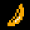

# **PACMAN_BY_NPC**
*Nguyễn Phú Cường - Dự án bài tập lớn môn lập trình nâng cao*

Đây là dự án cho bài tập lớn môn lập trình nâng cao, trong dự án này, mình lập trình game Pacman bằng ngôn ngữ [C++](https://en.wikipedia.org/wiki/C++), sử dụng thư viện [SDL 2.0](https://www.libsdl.org/download-2.0.php).

Hiện tại thì việc push code lên github của mình đang gặp một số lỗi, mình chưa thể up code lên từ tầm 20 tháng 4 nên trong quá trình đó sẽ không có bất cứ cập nhật gì.

Big Update (3:14 26/4/2024): Anh mentor đã giúp mình push được code lên github, thay đổi ở đây đó là tạo folder .ignore bỏ qua những phần không cần push, tạo branch mới và bằng cách nào đó push được code lên thì mình cũng không hiểu lắm.

Nhìn chung thì may mắn mình vẫn push được code trước deadline, 10 điểm không có nhưng cho anh Nguyễn Vũ Thanh Tùng.

Mình học về thư viện SDL2 ở kênh youtube [phattrienphanmem](https://www.youtube.com/@PhatTrienPhanMem123AZ), nếu muốn học về thư viện SDL 2.0, bạn có thể tham khảo trang web này và trang web [SDL Wiki](https://wiki.libsdl.org/SDL2/FrontPage).

Theo dõi tiến trình phát triển dự án của mình tại: [Develop Process](https://github.com/23020017nguyenphucuong/Pac/edit/main/Develop_Process)

Link video: 

## MỤC LỤC

[1. Cách tải thư viện SDL 2.0, cài đặt thư viện để có thể code game.](https://github.com/23020017nguyenphucuong/Pac?tab=readme-ov-file#c%C3%A1ch-t%E1%BA%A3i-th%C6%B0-vi%E1%BB%87n-sdl-20-c%C3%A0i-%C4%91%E1%BA%B7t-th%C6%B0-vi%E1%BB%87n-%C4%91%E1%BB%83-c%C3%B3-th%E1%BB%83-code-game)

[2. Cách cài đặt và chơi game.](https://github.com/23020017nguyenphucuong/Pac?tab=readme-ov-file#c%C3%A1ch-c%C3%A0i-%C4%91%E1%BA%B7t-v%C3%A0-ch%C6%A1i-game)

[3. Cấu trúc và hướng dẫn chơi game](https://github.com/23020017nguyenphucuong/Pac?tab=readme-ov-file#c%E1%BA%A5u-tr%C3%BAc-v%C3%A0-h%C6%B0%E1%BB%9Bng-d%E1%BA%ABn-ch%C6%A1i-game)

[4. Thuật toán của game](https://github.com/23020017nguyenphucuong/Pac?tab=readme-ov-file#thu%E1%BA%ADt-to%C3%A1n-c%E1%BB%A7a-game)

[5. Nguồn tham khảo code, hình ảnh và âm thanh.](https://github.com/23020017nguyenphucuong/Pac?tab=readme-ov-file#ngu%E1%BB%93n-tham-kh%E1%BA%A3o-code-h%C3%ACnh-%E1%BA%A3nh-v%C3%A0-%C3%A2m-thanh)

## NỘI DUNG

1. ### Cách tải thư viện SDL 2.0, cài đặt thư viện để có thể code game.

Phần này mình chia sẻ dựa trên kinh nghiệm có được từ dự án đầu tiên liên quan đến thư viện SDL 2.0, nếu không muốn đọc phần này, các bạn có thể chuyển đến phần sau ngay.
   
 Đầu tiên chúng ta cần tải thư viện SDL 2.0, ta truy cập vào [đường link này](https://www.libsdl.org/download-2.0.php) và tải đồng thời 4 thư viện:
 - [SDL 2.0](https://www.libsdl.org/download-2.0.php)
 - [SDL_image](https://www.libsdl.org/projects/SDL_image/)  
 - [SDL_mixer](https://www.libsdl.org/projects/SDL_mixer/)  
 - [SDL_ttf](https://www.libsdl.org/projects/SDL_ttf/)

Bốn công cụ dùng để lập trình game SDL 2.0 mà mình thấy khá phổ biến đó là Code::Blocks, Dev C++, Visual Studio Code, Visual Studio. Ở đây thì mình sử dụng [Visual Studio Community 2022](https://visualstudio.microsoft.com/fr/downloads/).

Để cấu hình thư viện SDL 2.0 trong Visual Studio, đầu tiên ta cần giải nén các file zip đã được tải xuống, sau đó thêm vào một thư mục chung để dễ dàng cho việc di chuyển, copy tất cả các file có đuôi `.dll` vào một thư mục riêng. Theo mình được học thì có 2 cách để project của chúng ta có thể nhận được thư viện, mình dùng cách sao chép thư mục chung chứa thư viện tới vị trí cùng cấp với file có đuôi `.sln`. Sau lần build đầu tiên, nếu đã sinh ra thư mục Debug thì ra sao chép các file ở trong folder dll ta đã tạo lúc trước, dán vào thư mục Debug, nếu tồn tại thư mục bên trong thì ta phải dán các file đã sao chép vào vị trí cùng cấp với file có đuôi `.exe` nằm ở trong thư mục Debug.

Tiếp theo là phần để nhận biết thư viện ở trong Visual Studio 2022. Ta chọn vào properties của project, sau đó thiết lập đường dẫn thư mục include, lib của từng thư viện. Phần này mình sẽ không nói kĩ hơn, nếu cần bạn có thể xem tại [cấu hình thư viện SDL 2.0](https://phattrienphanmem123az.com/lap-trinh-game-c-p2/game-cpp-phan-2-cai-dat-project.html).

2. ### Cách cài đặt và chơi game.

Thao tác này rất đơn giản, bạn chỉ cần truy cập đến file zip mình đã tạo sau đó tải xuống. Khi đã tải xuống xong, bạn giải nén ở bất kì vị trí nào trong máy sau đó tìm đến file có đuôi `.exe`. Mọi việc đã xong, giờ công việc tiếp theo là chơi game.

Trong quá trình test việc chạy file zip trong nhiều máy khác nhau, mình phát hiện ra một vấn đề, đó là một số máy không thể chạy được file có đuôi `.exe` mà mình dùng để chạy game. Điểm chung của những máy này là chúng đều không có các ứng dụng dùng để lập trình, hiện tại mình vẫn chưa biết vấn đề cụ thể nằm ở đâu, nhưng nếu mọi người và các thầy nếu không mở được, thì mong mọi người sẽ đọc được dòng này.

3. ### Cấu trúc và hướng dẫn chơi game
   
Trong trò chơi này, bạn trong vai một `Pacman` .

Bạn sẽ phải chạy khỏi những con `Ghost` đang săn lùng bạn, phải luôn chạy, đừng dừng chân, bởi vì bọn chúng biết phối hợp với nhau.

Bạn sẽ qua một màn khi mà bạn ăn hết tất cả các `dot`  trong map.

Trong mỗi màn sẽ có 4 `power dot` , cố gắng ăn chúng, bạn sẽ được săn lùng những con ghost trong một khoảng thời gian ngắn.

Trong mỗi màn cũng sẽ xuất hiện một loại `fruit`, tìm đến và ăn chúng, sẽ được cộng khá nhiều điểm đấy.

Mỗi lượt chơi bạn sẽ có 3 mạng, cố gắng chắt chiu từng mạng và giành được điểm số cao.

Tiếp theo ta sẽ nói đến những con `Ghost`

Giống như game gốc, ở đây cũng sẽ có 4 con Ghost với các cách di chuyển khác nhau để chúng về cơ bản có thể phối hợp với nhau, lần lượt đó là:

- `Blinky` : Kẻ nóng tính nhất, luôn đuổi theo Pacman.
- `Pinky` : Làm chim mồi, đi đến vị trí trước mặt Pacman 4 ô, nếu không đạt được mục đích, lập tức đuổi theo Pacman.
- `Inky` : Kẻ mưu trí nhất, đi đến vị trí đôi xứng với Blinky qua Pacman, nói cách khác chính là đón đầu Pacman, nó cũng sẽ đuổi theo Pacman nếu không đạt được mục đích.
- `Clyde` : Vây hãm, khi khoảng cách giữa nó và Pacman bé hơn 8 ô thì sẽ đi ngẫu nhiên quanh rìa bản đồ, khi phát hiện Pacman còn cách mình trên 8 ô thì đuổi theo Pacman.

  Ngoài ra thì đây là sản phẩm do trí tưởng tượng của mình:
- `Shady` : Kẻ du mục, ban đầu xuất hiện ở vị trí góc trái trên cùng của bản đồ, về sau mỗi lần bạn hồi sinh sẽ không trở về vị trí cũ như 4 con Ghost cơ bản. Giống những cao thủ sống dạt nhà trên phim, đầu tiên Shady sẽ tìm đến ngẫu nhiên một trong 4 con Ghost để học phong cách cây bắt, sau khi đã đụng vào nhau thì Shady đã học được, nên giờ anh ta có thể dùng phong cách đuổi của con Ghost mà anh ta gặp.

Ghost được chia ra làm 3 trạng thái:

- `Thăm dò` : Khi ở chế độ thăm dò, Ghost sẽ di chuyển ở một góc trên bản đồ trong một khoảng thời gian ngắn. Ở trong game gốc thì chế độ thăm dò sẽ được áp dụng với tất cả con Ghost, nhưng mình sẽ chỉ dùng chế độ thăm dò cho Blinky, thay vào đó sẽ set thời gian các Ghost khác ra khỏi lồng là lâu hơn.
- `Săn lùng` : Trong chế độ săn lùng, các Ghost sẽ phối hợp với nhau để ăn được Pacman, có thể bạn sẽ nghĩ các ghost sẽ di chuyển như nhau, tuy nhiên mỗi ghost sẽ có một mục tiêu khác nhau.
-   `Hoảng sợ` : Chế độ hoảng sợ của Ghost bắt đầu khi Pacman ăn được power dot. Khi đó Ghost sẽ không đuổi theo Pacman, nếu bị Pacman ăn thì sẽ chuyển thành `đôi mắt` , sau đó tìm đường đi ngắn nhất về cửa lồng để khôi phục trạng thái bình thường.

Mình chia game thành 3 mức độ đó là `Easy`, `Medium` và `Hard`. Với chế độ Easy thì sẽ có 4 con ghost truyền thống, tốc độ của nó chậm hơn Pacman. Ở chế độ Medium thì mình có đẩy tốc độ lên một chút, đẩy thời gian Ghost ra khỏi lồng nhanh hơn 1 chút. Ở chế độ cuối cùng là Hard, ban đầu mình định tăng thêm tốc độ, nhưng sau một vài lần chơi mình cảm thấy khá bất lực, nên mình quyết định tốc độ của nó không nên tăng. Ở chế độ khó chúng ta có `Shady`, và thời gian các Ghost xuất hiện cũng nâng lên thêm một mức, hi vọng mọi người không thấy nó quá khó.

#### Trong bản đồ sẽ có những hình khối sau:
|Item|Trạng thái|Tên|Điểm đặc biệt|
|----|----------|---|-------------|
||0|Dot|Pacman ăn được cộng điểm|
||1|Wall|Không đi qua được|
||2|Cage door|Cửa lồng Ghost, Ghost đi qua được còn Pacman thì không|
||3|Galaxy|Đi đến galaxy thì dịch chuyển sang galaxy còn lại|
||4|Galaxy|Đi đến galaxy thì dịch chuyển sang galaxy còn lại|
||5|Blank|Ô trống, đi qua được|
||6|Power dot|Pacman ăn được sẽ tăng sức mạnh|

### Cùng với đó là hoa quả, khi bạn ăn sẽ được cộng 100 điểm, nhưng phải chắt chiu đấy, vì nó biến mất cũng rất nhanh, khi nhân vật của bạn chết hoặc bạn ăn đủ số dot làm cho nó mất.

|Item|Tên|
|----|---|
||Banana|
||Cherry|
||Orange|
||Strawberry|

4. ### Thuật toán của game

Bản đồ mình quản lí bằng các ô, mỗi ô có kích thước là 30x30 pixel. Ban đầu mình muốn quản lí map bằng pixel, nhưng sau một tuần không thể tìm ra được giải pháp nào hợp lí, cũng không thấy có kênh hay trang nào làm bằng cách này thì mình đã chuyển đổi sang ô. Việc kiểm tra va chạm map với nhân vật cũng khá đơn giản, lưu ý lớn nhất là thay đổi và kiểm tra các trường hợp sao cho nhân vật không bị out ra khỏi map, bởi vì kích thước đường đi đúng bằng kích thước map nên rất dễ xảy ra sai số.

Trước tiên ta sẽ nói về sự di chuyển của Pacman

Pacman của mình có kích thước 30x30, bằng với kích thước của đường đi trong bản đồ, vì thế có một vấn đề xảy ra đó chính là khi di chuyển nếu muốn đổi hướng thì phải vào đúng chính xác giữa ô thì mới có thể chuyển hướng được, khi di chuyển thì khá khó chịu.

Sau hơn 1 tuần tìm kiếm giải pháp thì mình đã nghĩ ra một cách. Ban đầu mình quản lí di chuyển bằng một biến là `pacman_status_`, sau đó mình thêm một biến quản lí di chuyển nữa là `arrrow_status_`. Vậy mình quản lí chúng như thế nào? Bản chất thì `arrow_status_` mình sẽ dùng để quản lí lệnh di chuyển trực tiếp, có nghĩa là mình bấm vào bàn phím thì biến này sẽ được cập nhật. Còn `pacman_status_` thì mình sẽ quản lí lệnh di chuyển thứ 2 cần xử lí. Ta đã biết vai trò của 2 biến, giờ ta thực hiện di chuyển bằng cách kiểm tra xem lệnh di chuyển có thực hiện được không, tương đương với việc có bị chạm vào tường hay không, nếu di chuyển được thì ta thực hiện với `arrrow_status_`, ngược lại ta xử lí với `pacman_status_`. Mình cũng đã tạo thêm mũi tên ở bên ngoài Pacman, hướng của mũi tên sẽ là trạng thái của `arrrow_status_`, còn hướng của Pacman sẽ là trạng thái của `pacman_status_`. Xử lí xong tất cả điều này, việc di chuyển và xác định hướng di chuyển đã dễ dàng hơn rất nhiều.

Tiếp theo mình xét đến Ghost

Khác với game gốc, ở đây mình sẽ thực hiện việc di chuyển của Ghost bằng thuật toán BFS. Khi tải hình ảnh và gắn cho nó chuyển động một chiều thì khá đơn giản, mọi thứ chỉ cần làm đúng logic thì đã di chuyển mượt mà. Nhưng sau khi ta gắn thuật toán BFS cho Ghost thì đã xuất hiện nhiều hiện tượng lạ như nhiễu chuyển động, cụ thể là Ghost sẽ giật theo nhiều hướng mỗi khi phải chuyển hướng và bị đi xuyên qua map. Ban đầu mình định để cho việc kiểm tra va chạm với map ta không cần hàm kiểm tra như Pacman nữa, mà ta sẽ kiểm tra luôn bằng thuật toán BFS. Nhưng sau đó mình nhận ra có quá nhiều vấn đề với sự thay đổi này, nên mình đã quay lại với hàm kiểm tra va chạm với bản đồ. Sau đó chính hàm đó là hàm chữa lỗi cho sự di chuyển không nhất quán mà hàm BFS tạo nên, mình tạo ra một con số được gọi là sai số, rồi kiểm tra từng trường hợp, ban đầu mình không hi vọng lắm vào cách làm này, nhưng may mắn là mình đã kiểm tra tất cả các trường hợp và nó đã thành công. 

Công việc kiểm tra va chạm của Ghost và Pacman thì không mấy khó khăn, mình dùng 3 cặp tọa độ x, y với mỗi nhân vật, nói như này có thể gây khó hiểu, vậy bạn hãy tưởng tượng nhân vật là một hình vuông, thì 3 điểm mình tạo là điểm nằm ở `góc trên bên trái(1)`, điểm nằm ở `góc trên bên phải(2)` và `góc dưới bên trái(3)`, sau đó mình chia trường hợp thì cụ thể nó sẽ được chia thành 4 trường hợp mà mình sẽ nói ngay sau đây. Trường hợp đầu tiên đó là Ghost đi từ bên phải Pacman, khi đó ta xét điểm (1) của Pacman với điểm (2) của Ghost, ngược lại với Ghost đi từ bên trái của Pacman thì ta xét điểm (2) của Pacman với điểm (1) của Ghost. Tiếp theo nếu Ghost đi từ dưới lên vị trí của Pacman, ta xét điểm (3) của Pacman với điểm (1) của Ghost. Cuối cùng với trường hợp Ghost đi từ trên xuống vị trí của Pacman thì ta xét điểm (1) của Pacman với điểm (3) của Ghost. Sau đó ta cũng cộng thêm một lượng sai số, mình tìm bằng cách kiểm thử từng trường hợp.

Nguyên lí của mình về việc kiểm tra va chạm giữa nhân vật với bản đồ cũng chung tinh thần với việc kiểm tra va chạm bên trên, tuy nhiên kiểm tra va chạm và kiểm tra nhân vật khi chia trường hợp nó sẽ có những sai khác, vậy nên việc xác định ô được gán có sự thay đổi. Khi kiểm tra được va chạm với bản đồ, mình sẽ cho nhân vật dừng không di chuyển nữa, và nếu như nhân vật có đi quá để dè lên map thì mình cũng sẽ cộng trừ vị trí để cho nhân vật không thể chạm vào tường dẫn đến sai lệch về cơ chế kiểm tra.

Về phần chuyển động xuyên suốt game của Ghost, mình kiểm soát nó bằng các hàm di chuyển áp dụng cho từng con Ghost. Thuật toán di chuyển cũng không quá khó hiểu khi mà ta chỉ xoay quanh việc di chuyển bằng thuật toán BFS và di chuyển ngẫu nhiên, điều khó nhất có lẽ là áp dụng thuật toán BFS gắn với chuyển động của Ghost. Vậy vấn đề còn lại đó là việc chọn ra được mục tiêu cho từng con Ghost, với mục tiêu tmình quản lí bằng ô trên bản đồ để dễ dàng kiểm tra qua lại giữa Pacman, Ghost và bản đồ, việc này thì mình triển khai như sau:

- `Blinky`: Dùng thẳng thuật toán BFS với mục tiêu là Pacman.
  
- `Pinky`: Ta lấy mục tiêu là ô ở trước mặt Pacman cách nó 4 ô, để lấy được ô này thì ta phải xét từng trạng thái di chuyển rồi mới lấy được mục tiêu. Sau đó ta kiểm tra xem mục tiêu có nằm ngoài bản đồ hay không, nếu nằm ngoài thì ta xét đại lượng nào nằm bên ngoài thì ta sẽ cho nó là ô ngoài cùng nhất là ô đi được. Khi kiểm tra xong ta lại kiểm tra xem ô mục tiêu có phải là tường hay không, nếu không thì mục tiêu chính là ô đó, còn nếu đúng thì gán mục tiêu bằng ô hiện tại của Pacman.
  
- `Inky`: Đầu tiên sẽ lấy mục tiêu của Inky chính là đối xứng của Blinky qua Pacman, sau đó ta thực hiện xét trường hợp ngoại lệ giống Pinky, ta kiểm tra xem mục tiêu có nằm ngoài bản đồ hay không, nếu nằm ngoài thì ta xét đại lượng nào nằm bên ngoài thì ta sẽ cho nó là ô ngoài cùng nhất là ô đi được. Khi kiểm tra xong ta lại kiểm tra xem ô mục tiêu có phải là tường hay không, nếu không thì mục tiêu chính là ô đó, còn nếu đúng thì gán mục tiêu bằng ô hiện tại của Pacman.

- `Clyde`: Ta xét khoảng cách giữa Pacman và CLyde, nếu nó lớn hơn hoặc bằng 8 ô thì gán mục tiêu bằng vị trí hiện tại của Pacman. Ngược lại, nếu khoảng cách nhỏ hơn 8 thì ta chuyển thuật toán di chuyển thành đi ngẫu nhiên quanh rìa bản đồ.

- `Shady`: Mình dùng một hàm sinh ngẫu nhiên để chọn một trong 4 con Ghost làm mục tiêu đầu tiên mà Shady phải đi đến, sau đó mình giới hạn sinh số chỉ được 1 lần duy nhất trong mỗi lượt chơi. Đến phần xử lí di chuyển, mình thực hiện 1 tỏng 2 cách di chuyển là di chuyển đến vị trí của Ghost mục tiêu đầu và di chuyển theo mục tiêu, phần này cũng không quá rắc rối, mình chỉ cần cho hàm di chuyển đến con Ghost ban đầu chạy, khi nào xảy ra va chạm, mình thực hiện việc gán hàm chuyển động và mục tiêu của Ghost cơ bản sang cho Shady, đồng thời tắt hàm di chuyển đến Ghost đầu tiên và đè hàm di chuyển đến mục tiêu vào luôn.

Ở game gốc sẽ có 265 màn chơi, sau màn 265 sẽ gặp lỗi và đó sẽ là giới hạn của người chơi. Tuy nhiên trong game của mình, minh cho sinh vô hạn số màn, giả sử bạn là một người chơi cực giỏi, và không cần ăn uống gì thì trên lí thuyết bạn có thể chơi mãi mãi.

5. ### Nguồn tham khảo code, hình ảnh và âm thanh.

Những code cơ bản như in hình ảnh ra màn hình, hay cách tổ chức code mình đều học và tham khảo từ website [phattrienphanmem](https://phattrienphanmem123az.com/lap-trinh-game-cpp). Những ý tưởng cá nhân là của mình viết ra, không tham khảo thêm nguồn ngoài.

Hình ảnh và âm thanh của Pacman phải trả phí, nên mình đã mượn hình ảnh và âm thanh từ repo của một người anh khóa trước của UET: 
- [Hình ảnh](https://github.com/tungddk2/Pacman/tree/master/Source/Assets/Entity%20Image).
- [Âm thanh](https://github.com/tungddk2/Pacman/tree/master/Source/Assets/Sound).
